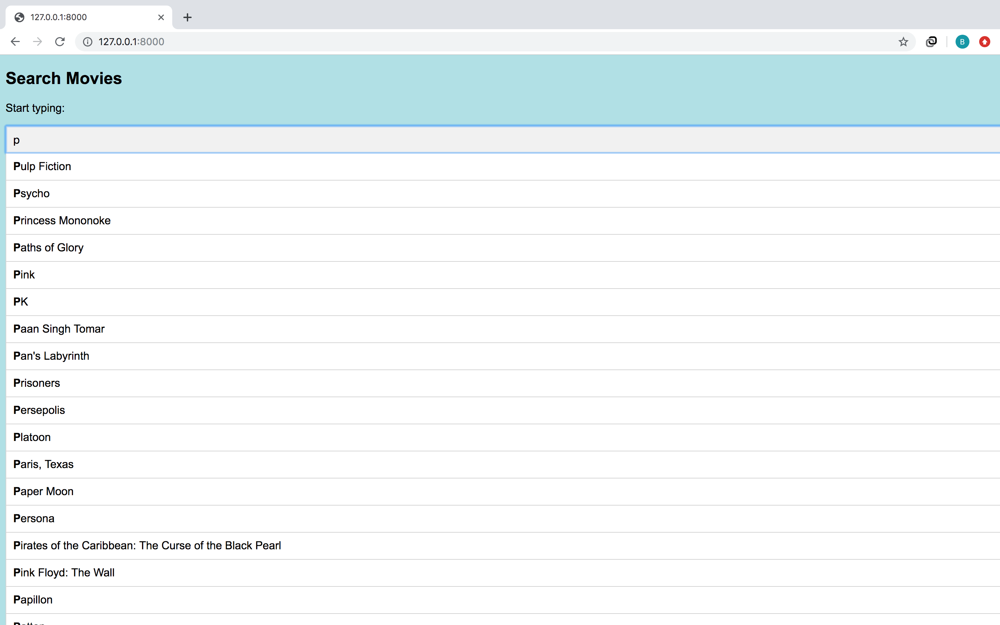
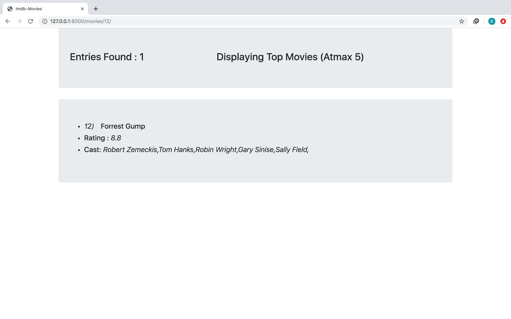
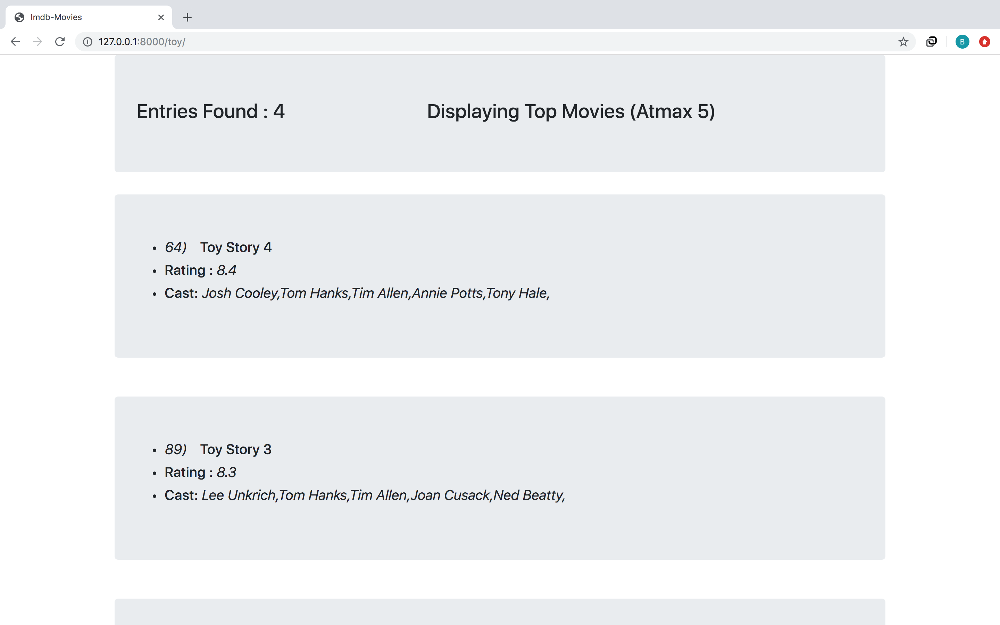
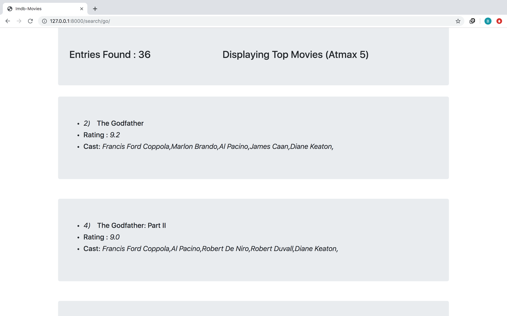
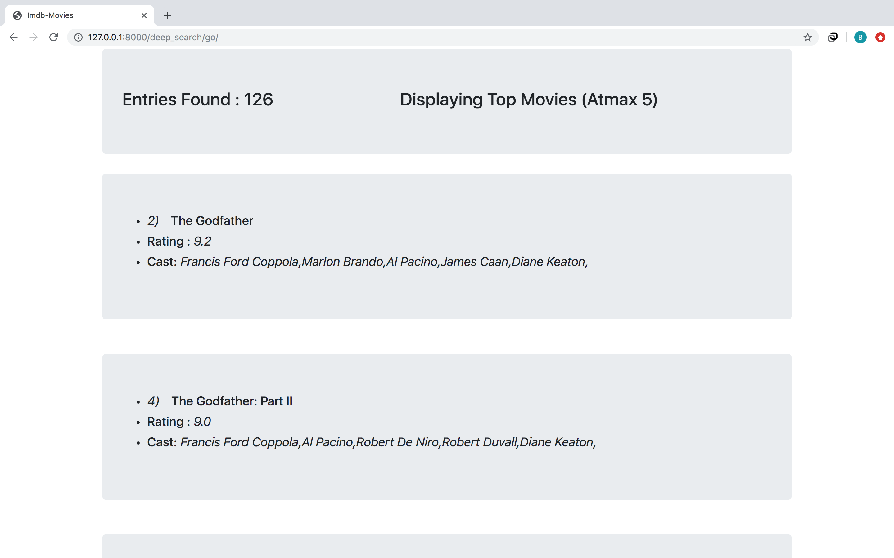

# Imdb-Scraped

Website made using Django,Mongodb 
 
Scraping done using selenium.
 
Made use of djongo for mongodb connection.
 
Demo is available at : https://drive.google.com/file/d/18feCHSmtq4swEvdZTRqUhiHpzqLg15Z7/view?usp=drivesdk

***
**->Scraping script is available in scraper.py**
***

## 5 API'S ARE MADE AVAILABLE

1) http://127.0.0.1:8000/      -  Autocomplete Feature , where suggestion appears when user keeps typing a new character.

---
2) http://127.0.0.1:8000/movies/<movie_id>    - Displays the Movie Details corresponding to movie_id.

---
3) http://127.0.0.1:8000/<prefix_>        - Displays the top 5 Movies sorted by rating which have the same prefix.
---

---
4) http://127.0.0.1:8000/search/<substring_>        - Displays the top 5 Movies sorted by rating where Movie title have the the string given as a substring.

---
5) http://127.0.0.1:8000/deep_search/<subsequence_>        - Displays the top 5 Movies sorted by rating where Movie title have the the string given as a subsequence.

---
